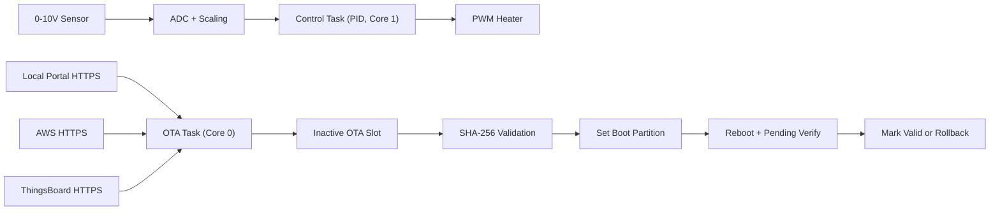

<p align="center">
  
</p>

<h1 align="center">ESP32 Robust OTA Architecture</h1>

<p align="center">
  Industrial firmware blueprint for <b>ESP32 heater control</b> with deterministic PID and secure OTA.
  <br/>
  FreeRTOS task isolation, HTTPS multi-source update pipeline, SHA-256 verification, rollback-safe boot.
</p>

<p align="center">
  
  
  
  
  
  
</p>

<p align="center">
  Published by <b>@dev-nicolasv</b>
</p>

---

## Overview

This repository provides a production-ready firmware foundation for industrial thermal control systems where deterministic control and safe remote lifecycle management are both mandatory.

System behavior is split into two strict execution domains:

1. High-priority real-time PID task for heater actuation
2. Independent OTA task for secure update checks and staged firmware download

The control loop never depends on network operations.

## Why this architecture

In industrial environments, a control function must keep timing guarantees even when network links degrade.

This design enforces:

- Core/task isolation between process control and OTA
- Deterministic loop pacing using `vTaskDelayUntil`
- OTA activation only after complete image integrity verification
- Rollback-safe boot validation through ESP32 dual-partition strategy

## Key Features

- OOP PID controller with anti-windup and bounded output
- 0-10V sensor acquisition path with ADC scaling and process normalization
- PWM heater output with fixed frequency and bounded duty command
- HTTPS-only OTA (Local Portal, AWS, ThingsBoard)
- SHA-256 streamed digest verification before boot partition switch
- Automatic rollback pathway for invalid post-update startup
- Task Watchdog (`esp_task_wdt`) integration for control and OTA tasks
- Source fallback order: Local Portal -> AWS -> ThingsBoard

## System Architecture



Extended design notes: [docs/ARCHITECTURE.md](./docs/ARCHITECTURE.md)

## Hardware Profile

### Sensor input path (0-10V)

- Physical sensor range: `0..10V`
- ESP32 ADC input: scaled to `0..3.3V`
- ADC pin default: `GPIO34`

### Heater output path

- PWM output pin default: `GPIO25`
- PWM channel: `0`
- PWM frequency: `2 kHz`
- PWM resolution: `10 bits`

All defaults are centralized in [include/AppConfig.h](./include/AppConfig.h).

## Repository Layout

- `src/main.cpp`: boot sequence, watchdog init, task startup
- `src/ControlTask.cpp`: deterministic PID control loop
- `src/OtaTask.cpp`: OTA background scheduling task
- `src/OtaManager.cpp`: metadata fetch, download, hash validation, partition switch
- `src/PIDController.cpp`: object-oriented PID implementation
- `include/AppConfig.h`: compile-time runtime configuration
- `partitions.csv`: factory + OTA A/B + otadata layout
- `tools/generate_ota_manifest.py`: OTA metadata generator
- `tools/local_ota_portal.py`: local HTTPS OTA server for plant/staging networks

## Quick Start

### 1. Configure network and OTA endpoints

Edit `platformio.ini` build flags:

- `WIFI_SSID`
- `WIFI_PASSWORD`
- `OTA_LOCAL_METADATA_URL`
- `OTA_AWS_METADATA_URL`
- `OTA_THINGSBOARD_METADATA_URL`

Optional auth headers per source are also supported.

### 2. Configure root certificates

1. Copy `include/PrivateCertificates.h.example` to `include/PrivateCertificates.h`
2. Add root CA PEM blocks for your endpoints
3. Keep `include/PrivateCertificates.h` private (already gitignored)

### 3. Build and flash

```bash
pio run
pio run -t upload
pio device monitor
```

## OTA Metadata Contracts

### Generic schema (Local Portal / AWS)

```json
{
  "version": "1.0.1",
  "url": "https://ota.example.com/esp32/firmware-1.0.1.bin",
  "sha256": "64_hex_chars_checksum",
  "size": 340977
}
```

### ThingsBoard shared attributes

```json
{
  "fw_version": "1.0.1",
  "fw_url": "https://ota.example.com/esp32/firmware-1.0.1.bin",
  "fw_checksum": "64_hex_chars_checksum",
  "fw_size": 340977
}
```

## Deployment Guides

- Local Portal: [docs/DEPLOYMENT_LOCAL_PORTAL.md](./docs/DEPLOYMENT_LOCAL_PORTAL.md)
- AWS: [docs/DEPLOYMENT_AWS.md](./docs/DEPLOYMENT_AWS.md)
- ThingsBoard: [docs/DEPLOYMENT_THINGSBOARD.md](./docs/DEPLOYMENT_THINGSBOARD.md)

## Release Workflow

Generate metadata from a built artifact:

```bash
python3 tools/generate_ota_manifest.py \
  --firmware .pio/build/esp32dev/firmware.bin \
  --version 1.0.1 \
  --url https://your-host/firmware-1.0.1.bin \
  --output release/metadata.json
```

Operational guidance:

- [docs/OPERATIONS_RUNBOOK.md](./docs/OPERATIONS_RUNBOOK.md)
- [docs/VALIDATION_PLAN.md](./docs/VALIDATION_PLAN.md)

## Security Notes

- OTA URLs must be `https://`
- Firmware is activated only after SHA-256 match
- New image requires post-boot validation mark as `valid`
- Failed startup health check triggers rollback path

## License

Pending project license definition.
