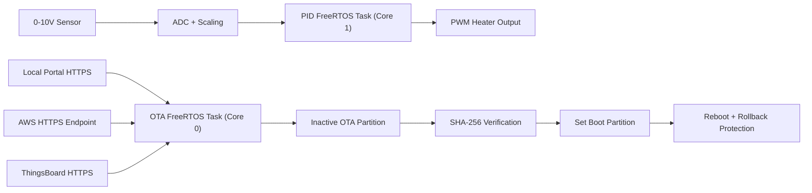

# ESP32 Robust OTA Architecture for Industrial PID Control

Production-oriented ESP32 firmware built with PlatformIO for industrial heater control, combining:

- Deterministic real-time PID loop in a dedicated FreeRTOS task
- Background secure OTA over HTTPS in a separate FreeRTOS task
- Dual-partition OTA with rollback protection
- Multi-source OTA strategy: Local Portal, AWS, and ThingsBoard

## 1. Key capabilities

- Deterministic control loop (`vTaskDelayUntil`) with no network dependency
- OOP PID implementation with anti-windup and bounded output
- PWM heater actuation and 0-10V sensor acquisition via ADC scaling
- SHA-256 firmware integrity verification before activation
- HTTPS-only OTA transport with certificate validation
- Staged updates in inactive partition + rollback-safe boot confirmation
- Per-task watchdog integration (`esp_task_wdt`)
- Fallback OTA source order: Local Portal -> AWS -> ThingsBoard

## 2. System architecture



Detailed design: [docs/ARCHITECTURE.md](docs/ARCHITECTURE.md)

## 3. Repository layout

- `src/`: firmware source code
- `include/`: configuration and interfaces
- `partitions.csv`: dual-OTA partition layout
- `tools/`: release and local portal tooling
- `docs/`: architecture and deployment runbooks

## 4. Quick start

### Prerequisites

- PlatformIO Core
- ESP32 development board (4MB flash minimum)
- TLS-capable OTA backend (local portal, AWS, or ThingsBoard)

### Build

```bash
pio run
```

### Flash

```bash
pio run -t upload
```

### Monitor

```bash
pio device monitor
```

## 5. Firmware configuration

Default configuration is in:

- `platformio.ini` (build flags and OTA endpoints)
- `include/AppConfig.h` (control, task, and OTA parameters)

For private root CAs (for example local enterprise PKI):

1. Copy `include/PrivateCertificates.h.example` to `include/PrivateCertificates.h`
2. Paste the root CA PEM values
3. Keep `include/PrivateCertificates.h` out of version control

## 6. OTA metadata contract

### Generic schema (Local Portal and AWS)

```json
{
  "version": "1.0.1",
  "url": "https://ota.example.com/esp32/firmware-1.0.1.bin",
  "sha256": "c0ffee...64hex...",
  "size": 340977
}
```

### ThingsBoard shared attributes schema

```json
{
  "fw_version": "1.0.1",
  "fw_url": "https://ota.example.com/esp32/firmware-1.0.1.bin",
  "fw_checksum": "c0ffee...64hex...",
  "fw_size": 340977
}
```

## 7. Deployment guides

- Local portal: [docs/DEPLOYMENT_LOCAL_PORTAL.md](docs/DEPLOYMENT_LOCAL_PORTAL.md)
- AWS: [docs/DEPLOYMENT_AWS.md](docs/DEPLOYMENT_AWS.md)
- ThingsBoard: [docs/DEPLOYMENT_THINGSBOARD.md](docs/DEPLOYMENT_THINGSBOARD.md)

## 8. Operations and release

- Runbook: [docs/OPERATIONS_RUNBOOK.md](docs/OPERATIONS_RUNBOOK.md)
- Validation checklist: [docs/VALIDATION_PLAN.md](docs/VALIDATION_PLAN.md)
- OTA manifest generator: `tools/generate_ota_manifest.py`

## 9. Security notes

- OTA is HTTPS-only (`https://` enforced)
- Firmware activation is blocked if SHA-256 does not match
- New image is marked valid only after startup self-check
- Rollback is automatic when post-boot validation fails

## 10. Status

- `pio run` compilation validated successfully on this repository state.
